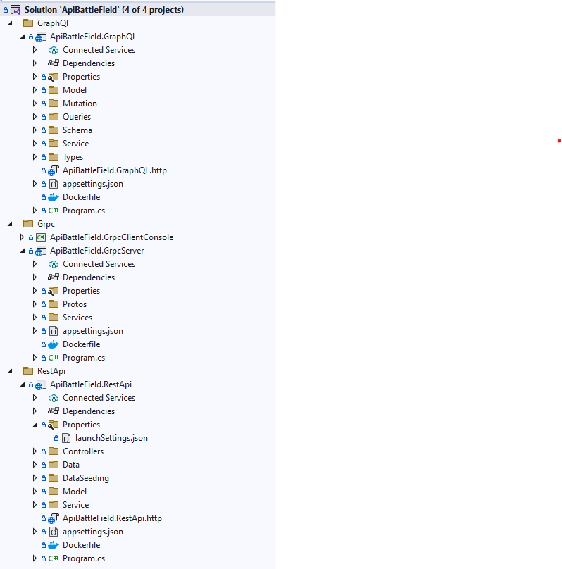

# API Comparison: REST, GraphQL, and gRPC

This project demonstrates the differences between REST API, GraphQL, and gRPC through example implementations. It includes basic CRUD operations for a product service using each API style.

## Give a Star! :star:
If you like or are using this project to learn or start your solution, please give it a star. Thanks!

## Support This Project

If you have found this project helpful, either as a library that you use or as a learning tool, please consider buying me a coffee:

<a href="https://www.buymeacoffee.com/codewithamit" target="_blank"></a>


## Table of Contents

- [Overview](#overview)
- [Technologies Used](#technologies-used)
- [Project Structure](#project-structure)
- [Getting Started](#getting-started)
- [API Implementations](#api-implementations)
  - [REST API](#rest-api)
  - [GraphQL](#graphql)
  - [gRPC](#grpc)
- [Comparison](#comparison)
- [Contributing](#contributing)
- [License](#license)

## Overview

This project showcases how to implement CRUD operations for a product service using three different API styles: REST API, GraphQL, and gRPC. Each API style has its own advantages and use cases, and this project aims to highlight these differences.

## Technologies Used

- **.NET Core**: For building the API services.
- **ASP.NET Core**: For creating RESTful and GraphQL services.
- **gRPC**: For creating the gRPC service.
- **Entity Framework Core**: For data access.
- **In memory**: For the database. (inprogress)

## Project Structure



## Getting Started

### Prerequisites

- .NET SDK
- Visual Studio
- For client - Postman or Insomnia or BloomRPC (optional)

### Running the Project

1. Clone the repository:
   ```bash
   git clone https://github.com/Amitpnk/api-comparison-guide.git
   cd api-comparison-guide
   ```

2. Build and run each service:

   - **REST API**:
     ```bash
     cd rest
     dotnet run
     ```

   - **GraphQL**:
     ```bash
     cd graphql
     dotnet run
     ```

   - **gRPC**:
     ```bash
     cd grpc
     dotnet run
     ```

3. Use tools like Postman, Insomnia, or BloomRPC to interact with the APIs.

## API Implementations

### REST API

- **Endpoint**: `/api/products`
- **HTTP Methods**: GET, POST, PUT, DELETE
- **Example Request**:
  ```http
  GET /api/products/1
  ```

    ```http
    POST /api/products
    {
    "id": 0,
    "name": "New Product",
    "price": 50
    }
    ```

    ```http
    PUT /api/products/1
    {
    "id": 1,
    "name": "Update Product",
    "price": 20
    }
    ```

    ```http
    DELETE /api/products/1
    ```

### GraphQL

- **Endpoint**: `/graphql`
- **Queries**:

  ```graphql
  query 
    Products {
        products {
            id
            name
            price
        }
    }
  ```

  ```graphql
  query {
    product(id: 1) {
      id
      name
      price
    }
  }
  ```
- **Mutations**:
  ```graphql
  mutation {
    createProduct(name: "New Product", price: 20.0) {
      id
      name
      price
    }
  }
  ```
    ```graphql
    mutation {
    updateProduct(id: 1, product: { name: "Updated Product", price: 50.0 }) {
        id
        name
        price
      }
    }
    ```

    ```graphql
    mutation {
        deleteProduct(id: 1)
    }
    ```


### gRPC

- **Service Definition**: `product.proto`
- **RPC Methods**: `GetProduct`, `CreateProduct`, `UpdateProduct`, `DeleteProduct`
- **Example Request**:
  ```proto
  rpc GetProduct (ProductIdRequest) returns (Product);
  ```

## Comparison

| Feature       | REST API                               | GraphQL                               | gRPC                                     |
|---------------|----------------------------------------|---------------------------------------|------------------------------------------|
| **Protocol**  | HTTP                                   | HTTP                                  | HTTP/2                                   |
| **Data Format** | JSON                                  | JSON                                  | Protocol Buffers (binary)                |
| **Flexibility** | Rigid endpoints                       | Flexible queries                      | Rigid service definitions                |
| **Performance** | Less efficient for complex queries   | Efficient for specific data requests  | Highly efficient and low latency         |
| **Client Support** | Broad support across all platforms | Broad support across all platforms    | Requires specific client libraries       |
| **Use Case**  | General web APIs                       | Efficiently fetching specific data    | High-performance, low-latency services   |

## Contributing

Contributions are welcome! Please submit a pull request or open an issue to discuss your ideas.

## License

This project is licensed under the MIT License. See the [LICENSE](../LICENSE) file for details.
